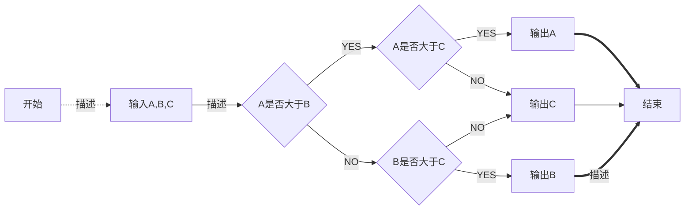

##  简介
 **Erp系统，服务于公司内部。**
### 前期规划
1. **按模块耦合度拆分为多个系统 (需要产品协助) ，首页抽离。**
>优势：
 - 首页渲染速度快;
 - 分系统打包，打包上线速度快，体积小;
 - 易于发布，每个系统可独立发布，方便修改;
 - 前端团队个人分配职责清晰，各自负责各自系统，	解耦性较强。
>劣势：
 - 可复用组件的重写问题，tagView切换多个系统间的菜单处理问题。
2. **Node (高性能异步IO) 中间层搭建，真正的前后端分离**
>优势：
 - 整合后端数据和接口，让后端专注于业务和逻辑。页面输出由前端去获取，方便开发，特别是需要调用多个接口的页面;
 - 为以后需要SSR，SEO的需求做	铺垫;
 - 部分小型C端项目可接入多种数据库，前端全栈快速开发上线，特别是实验性的小项目，节省开发时间和成本;
 - 代理，缓存，鉴权，包括路由，监控都可由这一层解决；
 - 可承受高并发。
>劣势：
 - 前端开发量较大，技术要求较高，密集型计算不适用，多线程处理方案。
3. **TypeScript**
>优势：
- 静态类型检查，增强规范性，减少开发bug
>劣势：
- 团队适应性问题
4. **hash路由改为history路由，符合URL规范，使用较为美观，主流公司使用，需要	  服务端部署重定向地址**
## 代码规范
```
命名规范：

组件封装：

数据管理：

css:

图片管理：

```
## 运行环境
1. **node版本统一**
2. **vscode配置统一，eslint保存规范**
## Vscode 配置
```
```
## 版本管理
```
- 主要开发分支 dev
- 发布分支 release
- 公测分支 test
- 回滚分支 rollback
- 各组员分支以昵称命名 

上线打tag 命名格式 tag-xxxx(日期)-x(当天版本号1开始)
```
## 打包发布


## 团队人员
姓名|技能|排行
--|:--:|--:
刘备|哭|大哥
关羽|打|二哥
张飞|骂|三弟


